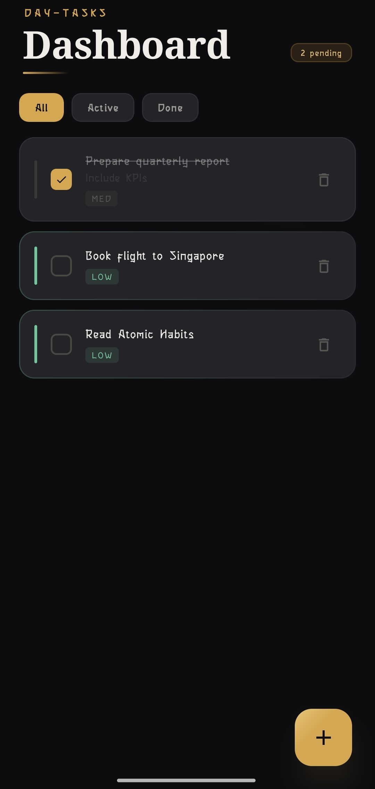
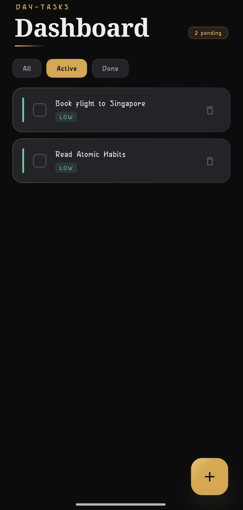
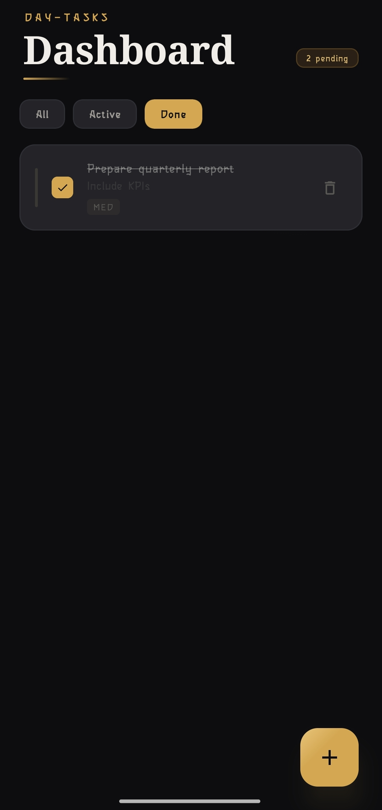
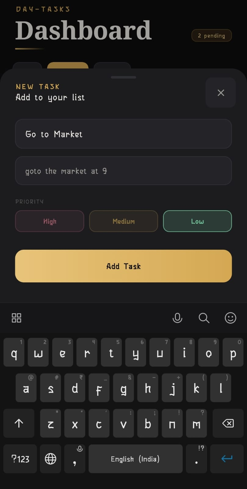

# Day-Tasks
### A Modern Android Task Manager App

Day-Tasks is a clean, minimal, and visually rich Android task management application built with **Jetpack Compose** and **Material Design 3**. It helps users organize their daily tasks with priority levels, completion tracking, and a smooth dark-themed UI.

---

## Screenshots

| Dashboard (All) | Active Tasks | Done Tasks | Add Task |
|---|---|---|---|
|  |  |  |  |

---

## Features

- Add tasks with title, description, and priority level
- Priority levels — High, Medium, Low with color indicators
- Filter tasks by All / Active / Done
- Mark tasks as complete with strike-through animation
- Delete tasks with a single tap
- Pending task count shown on dashboard
- Dark theatre-inspired theme with gold accents
- Persistent storage — tasks saved across app restarts

---

## Tech Stack

| Layer | Technology |
|---|---|
| Language | Kotlin |
| UI Framework | Jetpack Compose |
| Design System | Material Design 3 |
| Architecture | MVVM (ViewModel + StateFlow) |
| Storage | DataStore Preferences |
| Serialization | Kotlinx Serialization JSON |
| Icons | Material Icons Extended |
| Min SDK | 24 (Android 7.0) |
| Target SDK | 36 |

---

## Architecture

```
app/
├── java/com/example/todoapp/
│    ├── MainActivity.kt
│    ├── ui/
│    │    ├── screens/
│    │    │    ├── DashboardScreen.kt
│    │    │    └── AddTaskSheet.kt
│    │    ├── components/
│    │    │    ├── TaskCard.kt
│    │    │    └── FilterChips.kt
│    │    └── theme/
│    │         ├── Color.kt
│    │         ├── Theme.kt
│    │         └── Type.kt
│    ├── viewmodel/
│    │    └── TaskViewModel.kt
│    ├── data/
│    │    ├── TaskRepository.kt
│    │    └── DataStoreManager.kt
│    └── model/
│         └── Task.kt
│
└── res/
     ├── values/
     └── mipmap/
```

---

## Getting Started

### Prerequisites

- Android Studio Hedgehog or later
- JDK 17
- Android device or emulator with API 24+

### Installation

```bash
# Clone the repository
git clone https://github.com/SRAJANSHETTY8/Day-Tasks.git

# Open in Android Studio
File → Open → Select the cloned folder

# Build and run
Click Run ▶ or press Shift + F10
```

---

## Dependencies

```kotlin
// Jetpack Compose
implementation(platform(libs.androidx.compose.bom))
implementation(libs.androidx.compose.ui)
implementation(libs.androidx.compose.material3)

// ViewModel
implementation("androidx.lifecycle:lifecycle-viewmodel-compose:2.8.7")

// DataStore
implementation("androidx.datastore:datastore-preferences:1.1.1")

// Serialization
implementation("org.jetbrains.kotlinx:kotlinx-serialization-json:1.6.3")

// Material Icons
implementation("androidx.compose.material:material-icons-extended")
```

---

## How It Works

### Adding a Task
1. Tap the **+** button on the dashboard
2. Enter task title and description
3. Select priority — High, Medium, or Low
4. Tap **Add Task**

### Managing Tasks
- Tap the **checkbox** to mark a task complete
- Tap the **trash icon** to delete a task
- Use **All / Active / Done** filters to view tasks by status

### Data Persistence
Tasks are stored using **DataStore Preferences** with **Kotlinx Serialization**, ensuring all tasks persist across app restarts without a database setup.

---

## Future Improvements

- Due date and reminder notifications
- Firebase sync for cross-device access
- Task categories and tags
- Search and sort functionality
- Widget support for home screen
- Dark / Light theme toggle
- Task statistics and productivity insights

---

## License

This project is created for educational and portfolio purposes.

© 2026 Day-Tasks — Srajan Shetty
